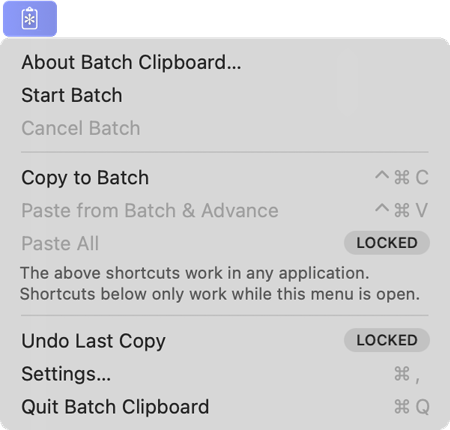

There are very few differences between the GitHub and the free Mac App Store
versions, however the latter has the ability for you to make an in-app purchase
to support development of the app, and in exchange have a few bonus features enabled.

Without the bonus features, these are the minor differences between the two versions:

- **Self-update features**

    The one feature that's only in the GitHub version is customizable self-updates
(using the Sparkle framework) and the related controls in the General panel
of the Settings window.
The Mac App Store itself does app updates and so these features are necessarily
removed in that version.

- **Support Us panel**

    The Mac App Store version has a Support Us panel in the Settings window,
it's where the in-app purchase can be made to support app development and
unlock the bonus features.

- **Bonus feature promotion**

    The Mac App Store version also promotes a couple of those bonus features
for the week after the app is first used, showing two of the added menu items
with a “locked” badge, selecting them shows an alert offering to open the
Settings window panel mentioned above.
Those promotional items disappear after a week but can also be turned off
anytime in the General panel of the Settings window.

    

- **Rate and review alert**

    The Mac App Store version shows the standard alert to rate and review the app
after a certain amount of time using the app. As per Mac App Store guidelines,
this alert is shown only once.

- **Minor text differences**

    There are differences in the text of the Intro window shown on first launch
(mention of bonus features and in-app purchase), the About box (following the
version number it identifies the Mac App Store vs GitHub download version),
and the the credits window which can be opened from About box.

## About the Bonus Features

<!-- The bonus features in the Mac App Store version are unlocked by a one-time in-app purchase.
These are the bonus features, described in following pages: -->

The bonus features in the Mac App Store version are unlocked by a one-time in-app purchase, described in following pages:

- [Paste All / Paste Multiple](Bonus-Feature-Menu-Items.md)
- [Undo Last Copy](Bonus-Feature-Menu-Items.md)
- [Start Batch Mode From History](Start-Batch-Mode-From-History.md)
- [Full History in the Expanded Menu](More-Expanded-Menu-Features.md)
- [History Item Filter](More-Expanded-Menu-Features.md)

> _Users within for-profit companies greater than 20 employees, however, are asked to
expense the yearly corporate subscription._
