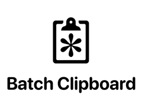

 . 

# Bananameter Labs Announces Batch Clipboard Version 2.0

> Vancouver, BC, Canada - September 3, 2025 - For immediate release
>
> Bananameter Labs today announced the release of version 2.0 of their first product Batch Clipboard, a utility for macOS released early 2025 and rated 5-stars in the Mac App Store. Version 2.0 adds 20 features and improvements.

----

Batch Clipboard is already less than a clipboard manager: less complication, less new UI you need to learn, less for you to manage. But the application gives your your Mac clipboard super-power often called "serial paste" or a "paste queue". The easiest to use compared to any of the clipboard managers with this feature: copy as many items as you like with Control-Command-C, and then Control-Command-V to paste each one.

Now version 2.0 brings you more “less”! Less performance hit to your system, less duplication of macOS 26 features, less complexity in the menu behind its menu bar icon, and if you want to, hide that icon automatically when not needed for less space taken up in your menu bar.

But also more: such as “Repeat Last Batch” to paste the most recent batch of items again with re-copying them. And even more “more” if you support its development with a one-time in-app purchase: you can save the last batch indefinitely to recall anytime. In fact, save as many as you like. Recall saved batches from a new section in the menu and optional give each a custom keyboard shortcut!

More than before and less than ever. So to celebrate “more” and “less”, that in-app purchase for more is now priced less for the next 2 weeks: US$1.99 so (more or less) half price!

Mac App Store: [https://apps.apple.com/app/batch-clipboard/id6695729238](https://apps.apple.com/app/batch-clipboard/id6695729238)  
Non-App Store download: [https://github.com/jpmhouston/Cleepp/releases/latest](https://github.com/jpmhouston/Cleepp/releases/latest)  
Website: [https://batchclipboard.bananameter.lol](https://batchclipboard.bananameter.lol)  
All 20 changes in version 2.0: [https://batchclipboard.bananameter.lol/Changes-Coming-In-Version-2.0/](https://batchclipboard.bananameter.lol/Changes-Coming-In-Version-2.0/)

----

About Bananameter Labs

Founded in 2024 by Pierre Houston, a longtime Mac and iOS developer, Bananameter Labs began with a plan to make simple, effective, joyful software tools. Batch Clipboard for macOS is the first product available as of September 2025. More products are planned also for iPhones, iPad and other platforms.

https://bananameter.lol  
media@bananameter.com  
@bananameterlabs on bsky, mastodon
