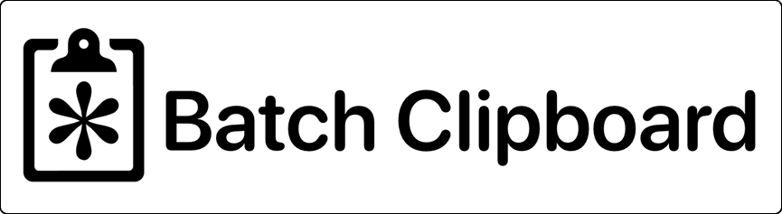

Batch Clipboard is a free, simple menu bar utility for macOS that that adds the ability
to copy and paste many items together. This feature is also known as a "clipboard queue" or
as "sequential paste" in other, large clipboard manager apps.
This app is for people who don't want a large and complex clipboard manager that has a lot of
new interface elements to learn, yet still want to the clipboard queue feature at times.

> Batch Clipboard is derived from the open source clipboard manager Maccy,
if you **do** want a great full-featured Mac clipboard manager check it out [here](https://maccy.app/).

Launch Batch Clipboard and you can simply use the app's global shortcut
<kbd>CONTROL (^)</kbd> + <kbd>COMMAND (⌘)</kbd> + <kbd>C</kbd> to copy multiple items and then
<kbd>CONTROL (^)</kbd> + <kbd>COMMAND (⌘)</kbd> + <kbd>V</kbd> to paste them in the same order.

You can choose to launch the app on startup and always have these shortcuts available,
or launch it when you need it and quit it from its menu afterwards.
It's a fast native application, is local only and never shares your clipboard history
with anyone or transmits them to any online servers.
Also, it's open source, and free to download on GitHub or the Mac App Store.
(The App Store version has some additional features unlocked an in-app purchase, one-time US$3.99)

- [Get from the Mac App Store](https://apps.apple.com/app/batch-clipboard/id6695729238)
- [Download from GitHub](https://github.com/jpmhouston/Cleepp/releases/latest)

Also, at times there may be a beta available [on GitHub](https://github.com/jpmhouston/Cleepp/releases) or [from TestFlight](https://testflight.apple.com/join/epg3cusH).

Version 1.0.x of Batch Clipboard works on macOS Big Sur 11.0 or higher.

---

I humbly ask for your consideration of support, to myself by way of the in-app purchase
of the App Store version, or with a [tip at buymeacoffee.com](https://www.buymeacoffee.com/bananameterlabs).
*Also please consider supporting the original authors of [Maccy](https://maccy.app/) with a
donation to them at their buymeacoffee [page](https://www.buymeacoffee.com/p0deje).*

Made by [Bananameter Labs](https://bananameter.lol). Find us on some social media services
as `bananameterlabs`, see the logo buttons in the footer below.
